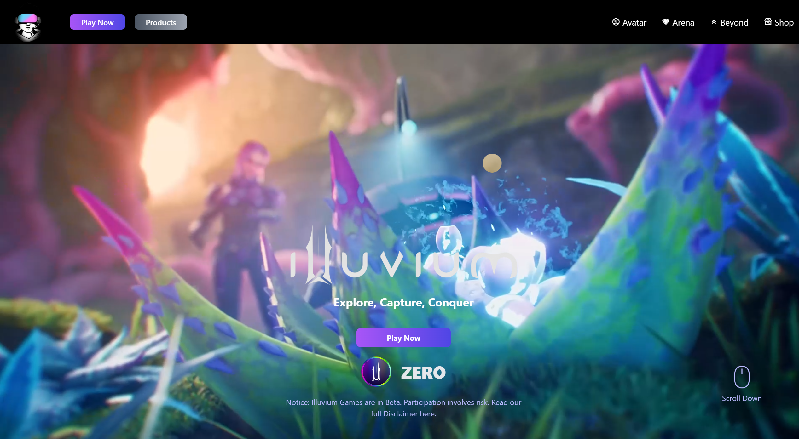

# 🎮 Gaming Website - Fighter Arena

A modern, interactive gaming website showcasing character selection, 3D models, and arena battles. Built with React, featuring smooth animations and immersive 3D experiences.



## ✨ Features

- **Interactive Character Selection**: Choose between VIKI and EVA fighters with animated transitions
- **3D Model Integration**: Spline 3D models for immersive character visualization
- **Custom Cursor Effects**: Dynamic cursor that responds to 3D model areas
- **Responsive Design**: Fully responsive across desktop, tablet, and mobile devices
- **Smooth Animations**: Framer Motion powered transitions and effects
- **Modern UI**: Clean, gaming-inspired interface with glassmorphism effects
- **Video Integration**: Auto-playing video cards in the arena section
- **Social Links**: Integrated LinkedIn, GitHub, and website links

## 🚀 Technologies Used

### Frontend
- **React 19.1.0** - Modern React with latest features
- **Vite 7.0.3** - Fast build tool and development server
- **Tailwind CSS 3.4.17** - Utility-first CSS framework
- **Framer Motion 12.23.1** - Animation library for React

### 3D & Graphics
- **Spline** - 3D model integration (@splinetool/react-spline)
- **Custom Cursor** - Interactive cursor with blend modes

### Icons & UI
- **Lucide React** - Beautiful, customizable icons
- **Boxicons** - Additional icon library
- **PostCSS & Autoprefixer** - CSS processing

### Development Tools
- **ESLint** - Code linting and quality
- **Vite Plugin React** - React support for Vite

## 📁 Project Structure

```
Gaming-website/
├── public/
│   ├── images/
│   │   ├── bento-card1.png
│   │   ├── EVA.png
│   │   ├── VIKI.png
│   │   ├── logo.png
│   │   └── illu-*.png
│   ├── videos/
│   │   ├── hero.mp4
│   │   ├── bento-card2.mp4
│   │   ├── bento-card3.mp4
│   │   ├── bento-card4.mp4
│   │   └── bento-card5.mp4
│   └── thumbnail.png
├── src/
│   ├── components/
│   │   ├── Header.jsx
│   │   ├── Hero.jsx
│   │   ├── Characters.jsx
│   │   ├── Arena.jsx
│   │   └── Footer.jsx
│   ├── App.jsx
│   ├── main.jsx
│   └── index.css
└── Configuration files...
```

## 🎯 Components Overview

### Header
- Navigation menu with smooth scroll effects
- Responsive hamburger menu for mobile

### Hero
- Immersive landing section with background video
- Call-to-action buttons with hover effects

### Characters
- Interactive fighter selection (VIKI & EVA)
- Real-time stats visualization with progress bars
- 3D model integration with Spline
- Custom cursor effects in 3D areas
- Smooth character switching animations

### Arena
- Bento grid layout with video cards
- Hover effects and scaling animations
- NFT store integration button

### Footer
- Social media links (LinkedIn, GitHub, Website)
- Brand logos and credits

## 🛠️ Installation & Setup

1. **Clone the repository**
   ```bash
   git clone https://github.com/yukikaze-coder/Gaming-website.git
   cd Gaming-website
   ```

2. **Install dependencies**
   ```bash
   npm install
   ```

3. **Start development server**
   ```bash
   npm run dev
   ```

4. **Build for production**
   ```bash
   npm run build
   ```

5. **Preview production build**
   ```bash
   npm run preview
   ```

## 🎨 Customization

### Colors
The website uses a violet/purple theme with glassmorphism effects. Main colors:
- Primary: `#8b5cf6` (violet-500)
- Secondary: `#a78bfa` (violet-400)
- Accent: `#c4b5fd` (violet-300)

### Adding New Characters
1. Add character data to the `Avatar` object in `Characters.jsx`
2. Add corresponding 3D model URL from Spline
3. Update the character selection cards

### 3D Models
- Models are hosted on Spline and embedded via iframe
- Each character has a unique Spline scene URL
- Models support mouse interaction and animations

## 🌐 Live Demo

Visit the live website: [https://gaming-website-cqgx.onrender.com/](https://gaming-website-cqgx.onrender.com/)

## 👨‍💻 Developer

**Luigi Morandini**
- GitHub: [@yukikaze-coder](https://github.com/yukikaze-coder)
- LinkedIn: [Luigi Morandini](https://www.linkedin.com/in/luigi-morandini-22307b34b)
- Website: [morandini.online](https://morandini.online)

## 📄 License

This project is open source and available under the [MIT License](LICENSE).

## 🙏 Credits

- **3D Models**: Created with Spline
- **Icons**: Lucide React & Boxicons
- **Animations**: Framer Motion
- **Styling**: Tailwind CSS
- **Build Tool**: Vite
- **Echoes.mp3**: Morandini Luigi  All Right Reserved

## 🚀 Future Enhancements

- [ ] Add more characters with unique abilities
- [ ] Implement actual battle mechanics
- [ ] Add sound effects and background music
- [ ] Create user profiles and progress tracking
- [ ] Add multiplayer functionality
- [ ] Implement NFT marketplace integration

---

⭐ **Star this repository if you found it helpful!**
